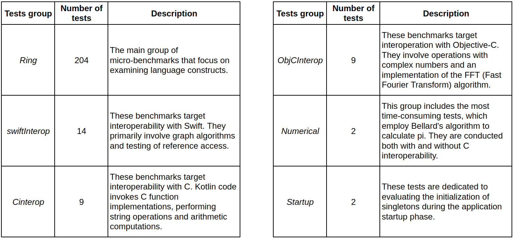

# More about Kotlin/Native benchmarks

The Kotlin/Native benchmarks consist of about 240 performance tests and the necessary infrastructure for execution. The vast majority of tests are single-threaded micro-benchmarks. They are categorized into distinct groups, see the picture below.

P. S. In the current version of the repository the number of tests is slightly higher.

## How the framework works

Tests execution has the following structure. Broadly speaking, the framework computes scores for each test in a sequential manner, recording the results in a report. The ***score calculation process*** looks like this:
* for a given number of attempts `attempts` (set to `20` by default), the framework measures the execution time of the test in nanoseconds;
* then, it calculates both the average and variation of these measurements;
* finally converts them to microseconds, which serves as the final score.

Going one level deeper, ***the process of a singular test measurement*** works like this:
* firstly, the framework initiates a warm-up phase, executing the test a predetermined number of times (defaulting to `10`);
* next, it restarts the test, and if the execution time is less than one second, the framework employs a specialized formula to calculate the desired number of iterations;
* finally, the framework measures the execution time in nanoseconds for the computed number of test iterations and calculates the average of these measurements.

Thus, to enhance result accuracy, the framework employs repeated executions and warm-up runs, a well-established practice commonly employed in language benchmarking, such as Java.

As a starting point for the analysis of the framework's design, you can use [launcher.kt](../../performance/shared/src/main/kotlin/org/jetbrains/benchmarksLauncher/launcher.kt) file, which defines `runBenchmark` key functions.

## Disadvantages of the framework & how to overcome them

The first limitation was ***the absence of readily available tools*** suitable for automating the experimentation process. While the project had all the requisite programs, configuring a pipeline that could launch benchmarks automatically with customizable configurations and report generation was necessary. Therefore, we created a series of bash scripts and documentation for their usage, see the main [README.md](../README.md).

The second drawback was ***the issue of noise***. Despite the implementation of the techniques within the project aimed at mitigating this problem, our initial runs still showed considerable noise. In order to assess the extent of this noise, we performed several tries of two separate runs of the entire framework on the same Kotlin/Native baseline compiler. Preliminary experiments showed that on a *MacOS Arm64* machine, each run had approximately `5%` of tests with results displaying differences in execution time ranging from `1%` to a maximum of `17%`, while on a *Linux x64* machine, about `11%` of tests exhibited differences from `1%` to a maximum of `50%`. Furthermore, this noise was observed randomly across different tests, with its absolute value being comparable to replacing `NotAtomic` with the strongest `SequentiallyConsistent` ordering, which caused differences in benchmark results up to `90%` and `70%` on *MacOS Arm64* and *Linux x64*, respectively.

While the presence of noise hindered the acquisition of reliable estimates regarding performance changes. To mitigate this problem, we employed several techniques to reduce noise in Kotlin/Native benchmarks, which is elaborated on in the [NOISE_ANALYSIS_REPORT.md](noise-analysis/NOISE_ANALYSIS_REPORT.md).

## Extending the dataset with multi-threaded benchmarks

In order to validate a multi-threaded case, we implemented ***custom micro-benchmarks*** that were specifically designed to assess concurrent behaviours.

Mainly, we adapted existing tests from the Kotlin/Native benchmark suite. Specifically, we utilized the single-threaded tests belonging to the `Ring::ForLoops` group, which computes the sum of elements in arrays of different primitive types. We selected these tests because they are simple and focused on the fundamental design of the language. Moreover, during our preliminary experiments, these tests consistently exhibited significant changes in performance when replacing `NotAtomic` with the `Unordered`, thus, the `Ring::ForLoops` tests might be regarded as a worst-case scenario, where the effects of the changes would be most pronounced. Finally, we developed additional multi-threading micro-benchmarks that specifically targeted the optimizations available for `NotAtomic` in comparison to `Unordered`.

Our initial experiments have validated the effectiveness of the implemented benchmarks. These tests demonstrated relatively low levels of noise compared to the only existing multi-threaded test within the Kotlin/Native benchmark suite. On average approximately `17%` of the implemented tests exhibited a noise level of around `4-5%`, with the highest observed noise level reaching `11%`. In contrast, the multi-threaded `Ring::SplayWithWorkers` test consistently displayed a significantly higher noise level of `48%`. Moreover, the specifically designed tests aimed to highlight the impact of variations in optimizations between `NotAtomic` and `Unordered`, revealed a significant performance change when executed using the modified compiler. Thus, the effectiveness of the implemented tests was confirmed.

Regrettably, ***our search for a suitable real-world macro-program*** for benchmarking purposes has not been successful so far. Nonetheless, we pursue this experiment in the future. We identify the [`Ktor` framework](https://github.com/ktorio/ktor), widely used for constructing server applications, as a promising candidate due to its popularity and high-performance capabilities.

## Further navigation

In the [noise-analysis](noise-analysis) directory one can find the results of evaluating and mitigating the noise, which are described in the [NOISE_ANALYSIS_REPORT.md](noise-analysis/NOISE_ANALYSIS_REPORT.md). 

In the [compilation-schemes-comparison](compilation-schemes-comparison) directory the target reports of the research are present. Namely, [PRELIMINARY_RESULTS.md](compilation-schemes-comparison/PRELIMINARY_RESULTS.md) describes the preliminary results of different compilation schemes comparisons, while [UNORDERED_VS_BASELINE_RESULTS.md](compilation-schemes-comparison/UNORDERED_VS_BASELINE_RESULTS.md) briefly reports the main results, i.e. the preformance degradation of `NotAtomic` to `Unordered` change.