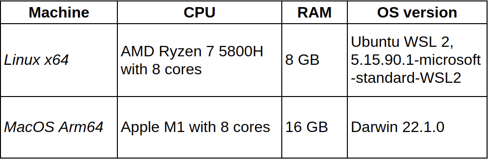

# Technical profile of the research machines

When conducting experiments on compilation schemes, it is beneficial to consider different computer architectures. In our research we have used two machines so far: *Linux x64* and *MacOS Arm64*. Their technical specifications are shown below.

*Warning!* It is important to highlight that, unfortunately, we needed to use `Ubuntu WSL 2` on `Windows 11` as the *Linux x64* environment. A modern WSL fully possesses the properties of the `x86_64` architecture; therefore, it suited our experimental purposes. However, WSL usage might caused some currently unknown effects, that, for example, might caused the higher noise level and the stronger performance degradation in the results.

The future work is to validate *Linux x64* results on another machine without any WSL usage.
