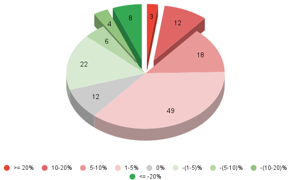
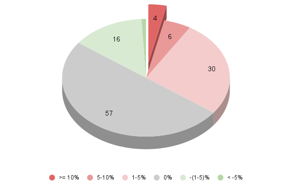
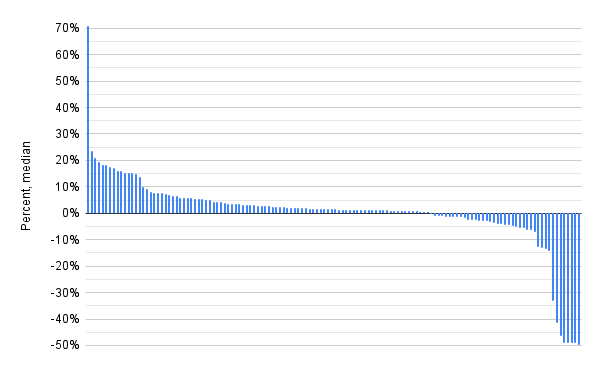
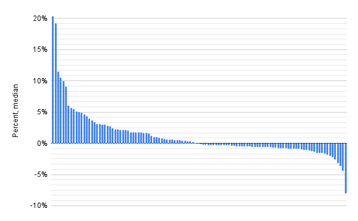
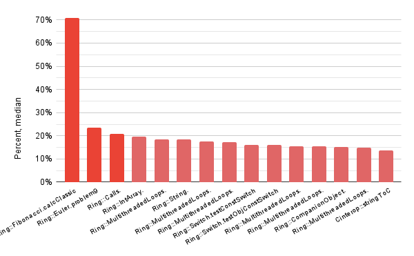
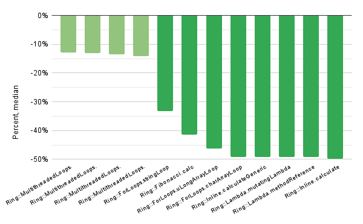
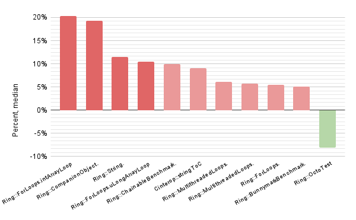

# Unordered vs baseline: final benchmark results

In this report, we present the outcomes of the conducted experiments for the evaluation of performance degradation of *NotAtomic* to *Unordered* change.

The methodologie of the aggregation of the benchmarking reports and filtering out the noisy data is explained in detail in the [UNORDERED_VS_BASELINE_METHODOLOGIE.md](UNORDERED_VS_BASELINE_METHODOLOGIE.md).

All the aggregated data with the various plots can be found [in the Google Sheets](https://docs.google.com/spreadsheets/d/1ZiB5rt57fduiVPeOdgUmD7YuFXC_zYROd--_aemORd8/edit?usp=sharing). Nevertheless, the most important figures and their analysis are presented below.

## Figures of the tests with trusted performance changes

### Distribution by groups

#### *Linux x64*

#### *MacOS Arm64*

### Score variations

#### *Linux x64*

#### *MacOS Arm64*

### Score variations of the most significant tests

#### *Linux x64*: tests with the `>= 10%` change

#### *MacOS Arm64*: test with the `>= 5%` change

## Analysis of the results

The `Distribution by groups` figures illustrate the distribution of tests based on the magnitude of the changes. In this context, the gray shading labeled as "`0%`" indicates a significant but less than `1%` alteration. The `Score variations` figures present the scores corresponding to all significant score changes, thereby highlighting the maximum and minimum observed values. Finally, `Score variations of the most significant tests` section depicts the exact tests that showed the greatest performance change. 

***Performance degradation.*** The performance degradation resulting from the replacement of *NotAtomic* with *Unordered* exhibited a significant impact. Approximately `11%` of all filtered tests exhibited changes exceeding `10%` on the *Linux x64* platform, while approximately `9%` showed changes exceeding `5%` on the *MacOS Arm64* platform. Moreover, around one-third of the tests demonstrated slowdowns ranging from `1%` to `5%` on both machines.

***Performance improvements.*** Surprisingly, our results reveal the presence of not only performance degradation but also performance improvement in some tests. Initial analysis of the bitcode showed that their possible cause might be an accidental impact on the garbage collector. However, in general the degradation of performance is more pronounced than the improvement: across both machines, slowed tests are more prevalent, with absolute values of changes reaching larger magnitudes.

***Comparison between different hardware.*** The charts indicate that the `Arm64` architecture, represented by the *MacOS* machine, experienced a notably lesser impact compared to the `x86_64` architecture represented by the *Linux* machine. This observation holds true for both the number of tests exhibiting score differences and the absolute magnitudes of the changes. Notably, on the *Linux x64* platform, twice as many tests displayed a significant non-zero change, and the maximum slowdowns and accelerations differed in magnitude by more than `3` and `5` times, respectively.

***Multi-threaded benchmarks.*** Although they exhibited noticeable changes of approximately `15%` on *Linux x64* and changes ranging from `3%` to `5%` on *MacOS Arm64*, the single-threaded micro-benchmarks still yielded the most substantial score changes, as anticipated (single-threaded tests are theoretically the worst case in terms of performance degradation).

## Conclusion

In summary, the replacement of *NotAtomic* with *Unordered* led to noticeable and consistent performance degradation, observed in approximately `60%` of tests on *Linux x64* and `35%` of tests on *MacOS Arm64*. Quantitatively, the strongest slowdown, experienced by `10%` of the tests, exhibited an average degradation of `20%` on *Linux x64* and `10%` on *MacOS Arm64*. The maximum slowdown observed was `70%` and `20%` respectively.

Based on the obtained results, it is evident that replacing *NotAtomic* with *Unordered* is still accompanied by significant performance loss and cannot be implemented in the current Kotlin/Native compiler. Furthermore, these findings support the hypothesis regarding the insufficient performance of the *Unordered* implementation in LLVM. 

However, as a future work, a more thorough analysis of the bitcode and machine code is needed to identify the exact reasons for the obtained results.