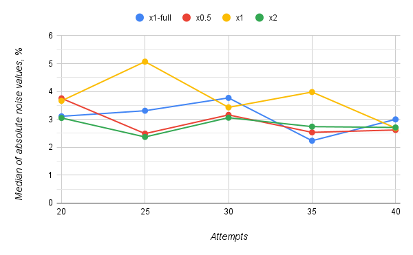
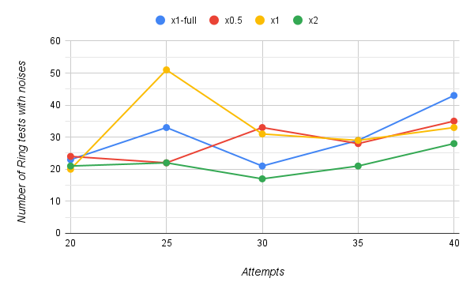

# Noise analysis report

In this report, we describe the structure of the noise in benchmark results and the methods we applied to reduce it. 

Before reading this report, one should understand the Kotlin/Native benchmarks structure in general, see [ABOUT_KN_BENCHMARKS.md](../ABOUT_KN_BENCHMARKS.md).

## Types of noise and their causes

Our observations revealed the presence of two distinct types of noise: consistent noise in certain tests and significant score discrepancies, reaching approximately `50%` and representing isolated outliers. Importantly, occurrences of both noise types were mostly observed intermittently between different runs of all benchmarks. In contrast, when the framework executed repeated test attempts to refine the outcome, minimal deviations in execution times were observed, indicating their consistency. Consequently, it is reasonable to infer that the predominant cause of the observed noise can be attributed to global factors, such as CPU throttling or incomplete release of resources between tests, potentially arising from bugs in the garbage collector.

## Mitigating the noise

In order to address the issue of noise, we used several techniques.

### Multiple runs aggregation

As our primary approach, we employed the technique of aggregation across multiple runs. Specifically, as previously described, noise predominantly arises between runs of the entire test suite. Consequently, we could mitigate this issue by averaging the results obtained from multiple such runs. 

This approach serves two primary purposes. Firstly, by utilizing an average, we are able to effectively ***eliminate sporadic random outliers***. Secondly, through the calculation of variance, we can ***identify consistently noisy tests*** and interpret their results with enhanced caution. Despite the significant time cost associated with the proposed approach, it helped us to largely mitigate the adverse effects of noise on the final outcomes.

### Adjusting internal parameters

To ***minimize noise absolute values in general***, we adjusted the internal parameters of the benchmarks. Specifically, in addition to the `attempts` parameter, which determines the number of runs for each test, we found the `benchmarkSize` parameter that establishes the size of each individual test within the main `Ring` suite. For instance, in tests belonging to the `Ring::ForLoops` subgroup, the `benchmarkSize` parameter specifies the size of the array used for calculating the sum, while in tests from the `Ring::Euler` subgroup, it represents the number of iterations for mathematical algorithms. 

We posited that increasing the number of runs for each test could further refine the scoring calculation, while change of the test sizes could enhance their resilience against external factors, thus reducing overall noise. This approach was considered ***potentially advantageous for consistently noisy tests*** that generate fluctuations owing to their intrinsic nature, which could be related to their size.

We conducted a preliminary investigation to assess the impact of the `attempts` and `benchmarkSize` parameters on the level of noise. Due to significant time constraints, we performed a single measurement for each unique combination of these parameters. Furthermore, we intentionally limited the range of `benchmarkSize` parameter variations to avoid potential occasions of extreme phenomena, such as resource scarcity or inadequately short runtime for accurate measurements. Notably, the *MacOS Arm64* platform exhibited significantly lower levels of noise compared to a *Linux x64* machine, and only negligible changes were observed in response to parameter adjustments. Therefore, the majority of experiments were conducted on the *Linux x64* machine.

Main noise experiments results can be found in the [`macosArm64/complete`](macosArm64/complete) and [`linuxX64/complete`](linuxX64/complete) directories for the *MacOS Arm64* and *Linux x64* platforms respectively. Their naming convention works in the similar way with the other reports: `[test source report]-vs-[test source report].html`, where `test source report` = `[test suite]-["benchmarkSize" multiplier]-["attempts" value]-[atomic ordering pass configuration]`.

* `[test suite]` can be of three types: `ring` &mdash; only from the `Ring` suite; `full` means executing all benchmarks; `balancedfull` &mdash; executing all benchmarks too, but in a balanced mode enabled on the *Linux x64* machine.
* `[atomic ordering pass configuration]` can be either `baseline2` or `baseline1`: while noise analysis we don't enable atomic ordering pass, to measure two different runs of the baseline compiler.

The plots of experiments, that depict the impact of `attempts` and `benchmarkSize` parameters on a noise level of `Ring` tests on *Linux x64* machine, are shown below.

The figures demonstrates the correlation between the `attempts` parameter and the number of `Ring` tests affected by noise (i.e., those exhibiting a difference greater than `1%`), as well as the median absolute noise value. These variables demonstrate the average noise level, which we aimed to minimize in this experiment. Each line on the plot corresponds to a distinct configuration of the `benchmarkSize` parameter. The default value for `benchmarkSize` is set at `10,000` (`x1`), and two additional options we tried are to double (`x2`) or halve (`x0.5`) the value. Moreover, the `x1-full` option represents the execution of the entire test suite, including tests other than `Ring`, to validate the absence of inter-test influences on noise levels.

Despite the experiment's limitations, the variant with a `benchmarkSize` multiplied by `2` exhibited a noticeable trend of reduced noise occurrences and lower noise values on average. This trend reached its optimum at `attempts = 30`, leading to the selection of this particular configuration for the final experiments. It is important to note that altering the `benchmarkSize` and `attempts` parameters did not guarantee improved noise reduction in the final results, but it increased the likelihood heuristically.

Thus, the optimal parameters found are: `benchmakrSize = 20,000` and `attempts = 30`.

### Improving error calculation

The final approach involved accurate error analysis. Each test is associated not only with a score calculated as the average of multiple `attempts` runs, but also with its spread. Throughout our experiments, it was observed that ***error calculations neglect the measurement accuracy***, resulting in errors with absolute values below a nanosecond. As an initial measure, we implemented a minimum error threshold of `1` nanosecond. Consequently, certain exceptionally fast tests no longer exhibited noise that surpassed the measurement accuracy. In future work, it would be nice to apply statistical techniques to accurately account for all types of errors and incorporate them in the analysis.

### Conclusion

To mitigate noise, we propose employing averaging over complete benchmark runs, enabling the removal of outliers and identification of particularly noisy tests. Furthermore, we have determined the optimal parameter configuration and refined the error calculation methodology. These advancements effectively reduced the overall quantity and magnitude of noise in the final results. 

Namely, we reached `90%` clean data from tests with changes &mdash; we can trust this results. Moreover, most of the remaining tests showed relatively small changes when replacing `NotAtomic` with `Unordered`, which are less than `5%`.